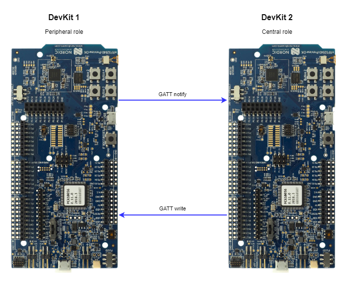

# nRF BLE data rate issue
Nordic DevZone Post: [This link](https://devzone.nordicsemi.com/f/nordic-q-a/114467/ble-data-rate-issue---gatt-write-extremely-slow)

> [!NOTE]
> Take a look at the bottom of this document for the solution.

During the creation of benchmarks for our BLE applications, I observed that the maximum transfer rate is significantly
lower (almost a factor of 8) when transmitting from ``Central -> Peripheral`` using GATT write.
The other direction from ``Peripheral -> Central`` using GATT notify performs as expected. <br>
Now the really weired part is, that doing both in parallel (to create bidirectional traffic) increases the throughput
from ``Central -> Peripheral`` significantly.

I compared my results with the values published on the [Nordic documentation](https://infocenter.nordicsemi.com/index.jsp?topic=%2Fsds_s140%2FSDS%2Fs1xx%2Fble_data_throughput%2Fble_data_throughput.html).
(Make sure to look at the table with the ATT MTU of 247 Bytes) <br>
There it looks like both directions (``Peripheral -> Central`` and ``Central -> Peripheral``) should have equal throughput.

I also tried this with the zephyr BLE stack (`CONFIG_BT_LL_SW_SPLIT=y`) but had the same problem.

I have also tested this on nRF Connect version 2.7.0, which shows the same result.

# Setup
|                     |                       |
|---------------------|-----------------------|
| nRF Connect version | 2.5.1                 |
| Hardware            | nRF52840 DevKit 3.0.0 |


The hardware setup is shown in the image below.


# Measurements
The table below shows a few parameters, which are consistent across all measurements

| Setting          | Value      |
|------------------|------------|
| Measurement span | 30 seconds |
| PHY              | 1M         |
| L2CAP MTU        | 517        |
| ATT MTU          | 251        |


## Scenario 1
| Config              | Value                     |
|---------------------|---------------------------|
| Connection Interval | 100 ms                    |
| Payload size        | 200 Bytes                 |
| Send direction      | Peripheral &rarr; Central |

> => 720 kbps

## Scenario 2
| Config              | Value                     |
|---------------------|---------------------------|
| Connection Interval | 100 ms                    |
| Payload size        | 200 Bytes                 |
| Send direction      | Central &rarr; Peripheral |

> => 92 kbps (unexpectedly slow)

## Scenario 3
| Config              | Value                        |
|---------------------|------------------------------|
| Connection Interval | 100 ms                       |
| Payload size        | 200 Bytes                    |
| Send direction      | Both (bidirectional traffic) |

> => 412 kbps (Peripheral &rarr; Central) <br>
> => 404 kbps (Central &rarr; Peripheral)


## Scenario n
The same behaviour can be observed with different connection intervals and payload sizes.


# Reproduce the measurements
1. Run ``west init -m https://github.com/derteufelqwe/nrf-ble-datarate-issue.git my-workspace``
2. Run ``west update`` inside `my-workspace`
3. Grab two nRF52840 3.0.0 DevKits
4. Flash the peripheral application ``applications/apps/peripheral`` onto board A <br>
   ``west build -b nrf52840dk_nrf52840 -d build-peripheral applications/apps/peripheral`` <br>
   ``west flash -d build-peripheral --dev-id <your_device_id>``
5. Flash the central application ``applications/apps/central`` onto board B <br>
   ``west build -b nrf52840dk_nrf52840 -d build-central applications/apps/central`` <br>
   ``west flash -d build-central --dev-id <your_device_id>``
6. Connect both ``nRF USB`` ports to your computer and open the serial shells for both boards
7. In one of the shells run ``main bench 200`` to start a benchmark with a payload size of 200 bytes. <br>
   This will start the sending process to the other board.
8. _Wait 30 seconds_
9. The result is logged in the other shell


# Solution
The root cause of the problem is the fact that the slave latency is > 0. This will allow the peripheral to skip
connection events to save energy. To fix that there are two options:

1. Update the connection parameters to set slave latency to 0
   ```yaml
   CONFIG_BT_PERIPHERAL_PREF_LATENCY=0
   ```
   or
   ```c
    struct bt_le_conn_param *conn_params = BT_LE_CONN_PARAM(99 / 1.25, 101 / 1.25, 0, 400);
    err = bt_conn_le_param_update(conn, conn_params);
    if (err) {
        LOG_ERR("Updating peripheral connection parameters returned error %d", err);
    }
   ```
2. Make the peripheral ignore the slave latency setting
   ```c
   sdc_hci_cmd_vs_peripheral_latency_mode_set_t params = {
       .conn_handle = conn->handle,
       .mode = SDC_HCI_VS_PERIPHERAL_LATENCY_MODE_DISABLE,
   };
   err = sdc_hci_cmd_vs_peripheral_latency_mode_set(&params);
   if (err) {
       LOG_ERR("Updating peripheral latency returned error %d", err);
   }
   ```
   
With any of these fixes I achieve the expected data rate.